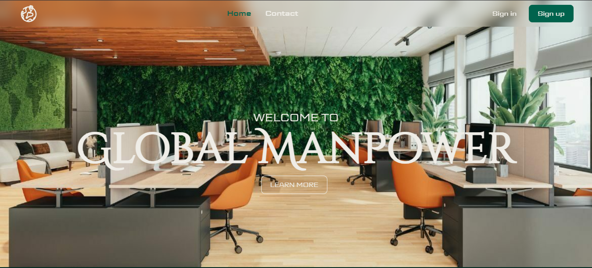
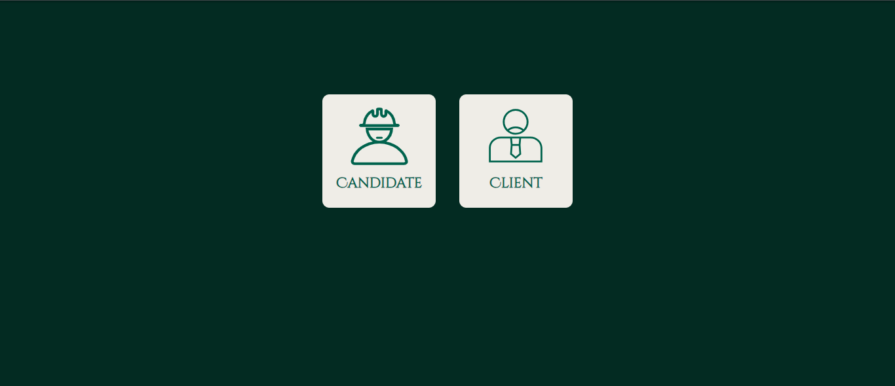
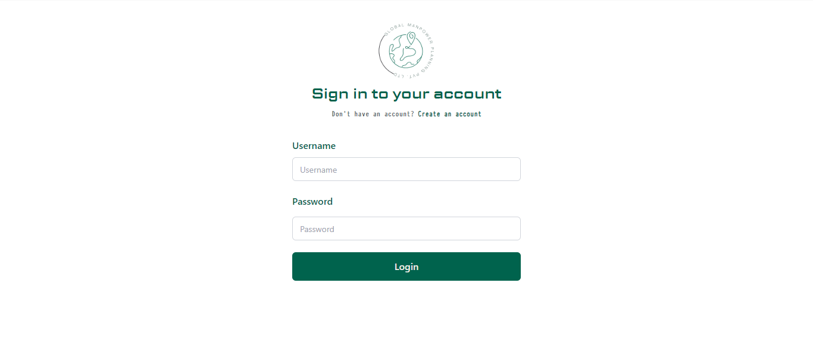
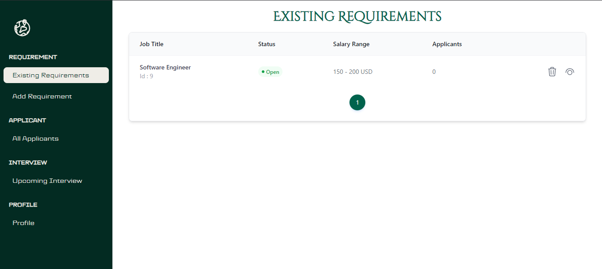
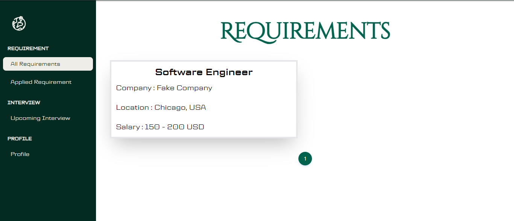
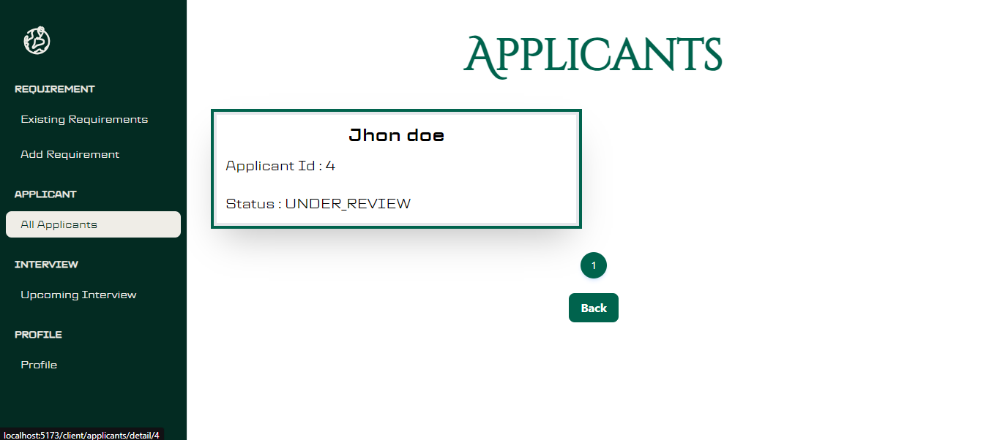
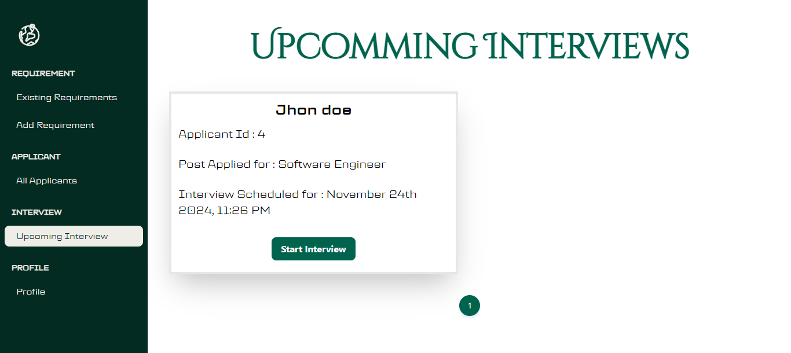

#Recruitment System

A full-stack web application designed to streamline the recruitment process for candidates and clients. Built with **Spring Boot** for the backend and **React** for the frontend, this system offers secure authentication, efficient document management, and dynamic scheduling features.

## Features

- **Authentication & Authorization**
  - Secure JWT-based login and role-based access control.
- **Candidate & Client Management**
  - CRUD operations for managing candidates, clients, and job requirements.
- **Interview Scheduling**
  - Real-time scheduling with datetime support.
- **Document Management**
  - PDF generation using OpenPDF, file storage as `Blob` data, and real-time PDF previews.
- **Notifications**
  - Automated email notifications with PDF receipts using JavaMailSender.

## Tech Stack

### Backend
- **Spring Boot**: RESTful API development
- **Hibernate/JPA**: Database ORM
- **MySQL**: Database management
- **JavaMailSender**: Email service

### Frontend
- **React**: Interactive user interfaces
- **Axios**: API requests
- **TailwindCSS**: Styling

## Installation

### Prerequisites
- Java 22+
- Node.js 21+
- MySQL
- Maven

### Steps

1. **Clone the Repository**
   ```bash
   git clone https://github.com/k4saad/global-recruitment-system.git
   cd Recruitment-System
   ```

2. **Backend Setup**
   - Navigate to the `backend` directory:
     ```bash
     cd backend
     ```
   - Update the `application.properties` file with your MySQL credentials:
     ```properties
     spring.datasource.username=your_username
     spring.datasource.password=your_password
     ```
   - Run the application:
     ```bash
     mvn spring-boot:run
     ```

3. **Frontend Setup**
   - Navigate to the `frontend` directory:
     ```bash
     cd frontend
     ```
   - Install dependencies:
     ```bash
     npm install
     ```
   - Start the React application:
     ```bash
     npm start
     ```

## Usage

- Access the application at `http://localhost:3000`.
- Use the provided login credentials or register a new account.

## Project Structure

### Backend
- `/src/main/java/com/global/recruitmentsystem`: Main application code
- `/src/main/resources`: Configuration files

### Frontend
- `/src/components`: React components

## Contributing

Contributions are welcome! Please open an issue or submit a pull request.


## Screenshots

Here are some screenshots showcasing the application:

### Home Page


### Login for cClient and Candidate


### Login forum for Client and Candidate


### Dashboard


### Client's Requirements


### Applications


### Upcomming Interviews



## Contact

For any queries, reach out at: [saadkhan108b@gmail.com](mailto:saadkhan108b@gmail.com).
